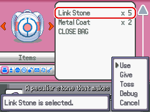

# Trade Evolution Stone
This script is for Pokémon Essentials. An item who trigger trade evolutions. Trade evolutions with hold item (like Onix to Steelix) only works while holding the correct item (Metal Coat).

## Screens

## Compatibility
Doesn't work on Essentials versions older than v19. To see other Essentials versions, look at [all branches](../../branches/all).

## Installation
Follow the [Script](/Script.rb) instructions.